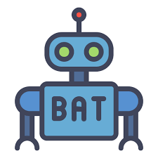

Learn the irregular verbs in Irish by chatting with a bot.

# Description

This is the source code for the [Bat Mírialta](https://bat-mirialta.pages.dev) project - an educational application under the umbrella of the [Abair](https://abair.ie/) project developed by the [Phonetics and Speech Laboratory](https://www.tcd.ie/slscs/clcs/psl/) at [Trinity College Dublin](https://www.tcd.ie/).

# Tools, Libraries, Packages...

The codebase is built on the same base stack as the main Abair site - see [here](https://github.com/JohnSloan8/abair/blob/master/README.md) for details - with the following additions:

### Chat UI

- [Chatscope](https://chatscope.io/) - a [UI component library](https://chatscope.io/storybook/react/) available as a [Storybook](https://storybook.js.org/) implementation

# Getting Started

Follow the same steps as [here](https://github.com/JohnSloan8/abair/blob/master/README.md) for front and back end.
